> **(GRAPHS,TABLES,DIAGRAMS,CHARTS & FIGURES = 54 samples)**

## IELTS Graph \#1

> **The charts below show the main reasons for study among students of different age groups and the amount of support they received from employers.**
>
> **Summarise the information by selecting and reporting the main features, and make comparisons where relevant.**

- **You should write at least 150 words.**

- **You should spend about 20 minutes on this task.**

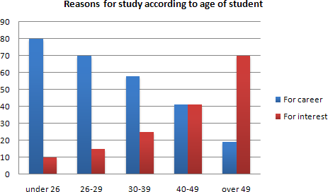

> *model answer:*
>
> The first graph shows that there is a gradual decrease in study for career reasons with age. Nearly 80% of students under 26 years, study for their career. This percentage gradually declines by 10-20% every decade. Only 40% of 40-49yr olds and 18% of over 49yr olds studing for career reasons in late adulthood.
>
> Conversely, the first graph also shows that study stemming from interest increases with age. There are only 10% of under 26yr olds studing out of interest. The percentage increases slowly till the beginning of the fourth decade, and increases dramatically in late adulthood. Nearly same number of 40-49yr olds study for career and interest. However 70% of over 49yr olds study for interest in comparison to 18% studing for career reasons in that age group.
>
> The second graph shows that employer support is maximum (approximately 60%) for the under 26yr students. It drops rapidly to 32% up to the third decade of life, and then increses in late adulthood up to about 44%. It is unclear whether employer support is only for career-focused study, but the highest level is for those students who mainly study for career purposes.
>
> *This is an answer written by a candidate who achieved a **Band 8** score. Here is the examiner's comment:*
>
> This answer summarises the key features of both charts and integrates them well. Clear trends are identified and supported with appropriately-selected figures. The answer could only be improved by adding an introduction to the general topic of the charts.
>
> The information is well organised, with a clearly-signalled progression. Linking words are used accurately and precisely, although there is occasional omission. Paragraphing is used well initially, but lapses in the later section.
>
> A very good range of vocabulary is used to convey the information concisely and accurately with only occasional inappropriacy. Words are used precisely and there are no errors in spelling or word form.
>
> A wide range of structures is used and most sentences in this answer are accurate. Errors are rare and do not affect communication in this answer

## IELTS Graph \#2

> You should spend about 20 minutes on this task.
>
> **The graph and table below give information about water use worldwide and water consumption in two different countries.**
>
> **Summarise the information by selecting and reporting the main features, and make comparisons where relevant.**
>
> Write at least 150 words.
>
> 

> *model answer:*
>
> The graph shows how the amount of water used worldwide changed between 1900 and 2000.
>
> Throughout the century, the largest quantity of water was used for agricultural Purposes, and this increased dramatically from about 500 km³ to around 3,000 km³ in the year 2000. Water used in the industrial and domestic sectors also increased, but consumption was minimal until mid-century. From 1950 onwards, industrial use grew steadily to just over 1,000 km³, while domestic use rose more slowly to only 300 km³, both far below the levels of consumption by agriculture.
>
> The table illustrates the differences in agriculture consumption in some areas of the world by contrasting the amount of irrigated land in Brazil (26,500 km³) with that in the D.R.C. (100 km²). This means that a huge amount of water is used in agriculture in Brazil, and this is reflected in the figures for water consumption per person: 359 m³ compared with only 8 m³ in the Congo. With a population of 176 million, the figures for Brazil indicate how high agriculture water consumption can be in some countries.
>
> (180 words)

# IELTS Graph \#3

> **You should spend about 20 minutes on this task.**
>
> **The diagram below shows how a central heating system in a house works.**
>
> **Summarise the information by selecting and reporting the main features, and make comparisons where relevant.**
>
> You should write at least 150 words.

> **SAMPLE ANSWER :**
>
> This diagram provides an overview of a domestic central heating system. It shows how the tank, boiler and pipes ensure a constant flow of hot water to both the radiators and the taps.
>
> The cold water enters the house and is stored in a water storage tank in the roof. From there ü flows down to the boiler, located on the ground floor of the house.
>
> The boiler, which is fuelled by gas or oil, heats up the water as it passes through it. The hot water is then pumped round the house through a system of pipes and flows into the radiators, located in different rooms. The water circulates through the radiators, which have small tubes inside them to help distribute the heat, and this warms each of the rooms. Some of the water is directed to the taps to provide hot water for the house.
>
> Once the water has been through the pipes and radiators, it is returned to the boiler to be re-heated and circulated round the house again.
>
> **Introduction:** First sentence. Overview: Second sentence.
>
> **Key features:** Entry of cold water into boiler; circulation of hot waterto radiators and taps; return of waterto boiler.
>
> **Supporting information:** direction of flow; types of boiler; location of radiators; radiator tubes
>
> **Paragraph breaks:** The paragraph breaks mark stages in the process.
>
> **Linkers:** and, from there, then, once, again Reference words: it, both, there, which, this
>
> **Topic vocabulary:** enters, stored, roof, flows, ground floor, located, passes, pumped, system, circulates, heat, directed, returned, re-heated
>
> **Less common vocabulary:** ensure, fuelled by, heats up, distribute the heat, warms
>
> **Structures:** An appropriate mix of active and passive structures and a range of sentence types are used.
>
> **Length:** 172 words

# IELTS Graph \#4

You should spend about 20 minutes on this task.

> **The graph below gives information about the preferred leisure activities of Australian children. Write a report for a university lecturer describing the information shown.**
>
> You should write at least 150 words.

> *model answer:*
>
> The graph shows the preferred leisure sctivities of Australian children aged 5-14. As might be expected, it is clear from the data that sedentary pursuits are far more popular nowadays than active ones.
>
> Of the 10,000 children that were interviewed, all the boys and girls stated that they enjoyed watching TV or videos in their spare time. In addition, the second most popular activity, attracting 80% of boys and 60% of girls, was playing electronic or computer games. While girls rated activities such as art and craft highly – just under 60% stated that they enjoyed these in their spare time – only 35% of boys opted for creative pastimes. Bike riding, on the other hand, was almost as popular as electronic games amongst boys and, perhaps surprisingly, almost 60% of girls said that they enjoyed this too. Skateboarding was relatively less popular amongst both boys and girls, although it still attracted 35% of boys and 25% of girls.
>
> (157 words)

# IELTS Graph \#5

You should spend about 20 minutes on this task.

> **The table below provide information on rental charges and salaries in three areas of London. Write a report for a university lecturer describing the information shown below.**
>
> You should write at least 150 words.

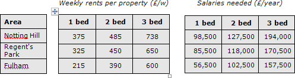

> *model answer:*
>
> The table shows two sets of related information: the relative cost, in pounds, of renting a property with one, two or three bedrooms in three different suburbs of London and an indication of the kind of annual salary you would need to be earning to rent in these areas.
>
> Of the three areas mentioned, Notting Hill is the most expensive with weekly rents starting at £375 (salary approximately f 100,000) and rising to £738 per week for a 3-bedroom property. To afford this, you would require a salary in the region of £200,000 per annum. Alternatively, Fulham is the cheapest area shown with rents ranging from
>
> £215 per week for a one bedroom property to £600 per week for a 3-bedroom property. To rent in this area, salaries need to be somewhere between £85,000 and £170,000 depending on the number of bedrooms required. For those able to pay in the middle price range for accommodation, Regent's Park might be a more suitable district.
>
> (163 words)

# IELTS Graph \#6

> You should spend about 20 minutes on this task.
>
> **The diagrams below give information about the Eiffel Tower in Paris and an outline project to extend it underground.**
>
> **Write a report for a university lecturer describing the information shown.**
>
> You should write at least 150 words.

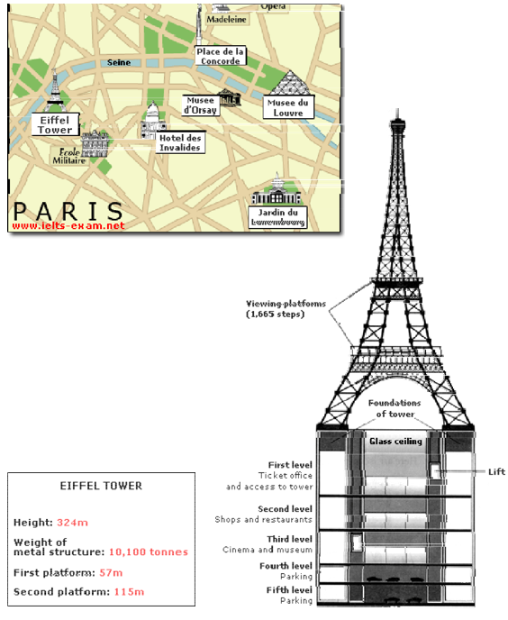

> *model answer:*
>
> The Eiffel Tower is situated close to the Seine River in Paris. It is a metal structure that is 1,063 feet high and weighs 7,417 tonnes. The tower has been a tourist attraction since 1889, when it was built, and there are 1,665 steps that can be climbed in order to reach the two viewing platforms.
>
> There are now plans to build below the foundations of the tower. These plans include the development of five underground levels that will incorporate the tower's ticket office, shopping facilities, a cinema and museum and two floors of underground parking.
>
> Although details have yet to be finalised, the principle is that the five floors will be connected by two vertical passenger lifts on either side of the tower. In addition, the floor immediately below the tower, which is planned to house the ticket office, will also consist of a large atrium with a glass ceiling so that visitors can look directly up at the tower itself.
>
> (162 words)

# IELTS Graph \#7

> You should spend about 20 minutes on this task.
>
> **The diagram below gives the information about the Hawaiian island chain in the centre of the Pacific Ocean. Write a report for a university lecturer describing the information shown.**
>
> You should write at least 150 words.

> *model answer:*
>
> The Hawaiian island chain, in the centre of the Pacific Ocean, is approximately 2,700 km in length. It is formed of volcanoes and the active ones are at the south-east tip of the archipelago, where Hawaii itself is located.
>
> It is believed that the chain began to form nearly 80 million years ago. Each island started to evolve after an eruption on the sea floor. First, a \`hot spot' existed on the ocean bed, which let out a plume of material called magma. This magma may originate as deep as 2,883km below the ocean bed. Next, further eruptions took place, which built up the volcano. Eventually, it emerged above the surface of the ocean.
>
> Since that time, the spume of magma has remained static as the Pacific tectonic plate moves in a north-west direction across it at a speed of 7-9cm per year. As it moves, a volcano forms as it passes over the hotspot and then become inactive when it has passed it.
>
> (164 words)

# IELTS Graph \#8

> You should spend about 20 minutes on this task.
>
> **The bar chart below shows the results of a survey conducted by a personnel department at a major company. The survey was carried out on two groups of workers: those aged from 18-30 and those aged 45-60, and shows factors affecting their work performance.**
>
> **Write a report for a university lecturer describing the information shown below.**
>
> You should write at least 150 words.

> *model answer:*
>
> The bar chart indicates a survey on two different age groups on the factors contributing to make their environment pleasant for working.
>
> These factors are divided into external and internal factors. The internal factors are team spirit, competent boss, respect from colleagues and job satisfaction. The external factors are chance for personal development, job security, promotional prospects and money.
>
> On the internal factors above 50% in both age groups agreed that team spirit, competent boss and job satisfaction are essential to make their environment pleasant. Whereas on the external factors, there are contrasting results. On the chance for personal development and promotional aspects, 80% to 90% of the younger groups were in favor while only less than 50% of the older group thought so. A similar pattern is also noted on job security. With regards to money, 69% to 70% on both age group said it is essential.
>
> In conclusion, the internal factors have similar responses from the two age groups while they had dissimilar responses on the external factors.
>
> (170 words)
>
> *This is an answer written by a candidate who achieved a **Band 7** score. Here is the examiner's comment:*
>
> The information contained in the bar chart has been described accurately and concisely and follows a clear progression. There is a clear introduction followed by effective comparisons between the age groups and a valid conclusion. Good formulaic phrases (the bar chart indicates, these factors are divided), although the candidate uses the same language to describe the factors in the bar chart and does not attempt to rephrase them in any way.

# IELTS Graph \#9

> You should spend about 20 minutes on this task.
>
> **The graph below compares the number of visits to two new music sites on the web. Write a report for a university lecturer describing the information shown below.**
>
> You should write at least 150 words.

> *model answer:*
>
> The graph shows people using new music places on the Internet in fifteen days period of time namely personal choice and trendy pop music.
>
> The overall trend shows fluctuation with slight Increased towards the end of the period.
>
> Starting with Music Choice websites; 40,000 people went on this new site on first-day. Half of them backed out the next day. In Contrast to this Pop Parade net sites were visited by 120,000 music lovers on day one which decreased slightly on the next day thereafter regaining the same fame on 3rd day.
>
> After 3rd day the enthusiasm for both music lines on Internet dropped slowly- reaching maximum fall of 40,000 on 7th day. Whereas Music choice gained popularity, slightly Improving to get the original strength of 30,000 viewers on screen, but was getting still less visiters than their opponent Pop group i.e. 40,000 on day 7.
>
> In the biegining of the next week both gained remarkable recovery after a few fluctuations for 8th and 9th day having 40,000 and 50,000 visiters respectively, reaching to their peaks of one and a half thousand new viewers for Pop Parade on 11th day showing a contrast of very few people visiting Music choice for the same day. Thereafter Music choice gained popularity on 12th day for having more than 120,000 new visiters on web.
>
> In the end of the period Pop sites were visited by maximum viewers of 180,000 whereas sites located to Music choice were not explored by more than 80,000 explorers on the last day of the report.
>
> (257 words)
>
> *This is an answer written by a candidate who achieved a **Band 6** score. Here is the examiner's comment:*
>
> Well organized with some good linking devices and collocations (gain popularity, remarkable recovery, decrease slightly) and some valid comparison of the music sites. However, some sentences are long and confusing (paragraph 5), some collocations are inaccurate (slight increased, reaching to their peaks) and there is some repetition (7th day, 3rd day, 11 th day). Some words are spelt incorrectly (poeple, Improoving, visiters, begining).

# IELTS Graph \#10

> You should spend about 20 minutes on this task.
>
> **The table below shows the proportion of different categories of families living in poverty in Australia in 1999.**
>
> **Summarise the information by selecting and reporting the main features, and make comparisons where relevant.**
>
> You should write at least 150 words.
>
> Give reasons for your answer and include any relevant examples from your own knowledge or experience.

> *model answer*
>
> The table gives a breakdown of the different type of family who were living in poverty in Australia in 1999.
>
> On average, 11% of all households, comprising almost two million people, were in this position. However, those consisting of only one parent or a single adult had almost doubt this proportion of poor people, with 21% and 19% respectively.
>
> Couples generally tended to be better off, with lower poverty levels for couples without children (7%) than those with children (12%). It is noticeable that for both types of household with children, a higher than average proportion were living in poverty at this time.
>
> Older people were generally less likely to be poor, though once again the trend favoured eldery couples (only 4%) rather than single eldery people (6%).
>
> Overall the table suggests that households of single adults and those with children were more likely to be living in poverty than those consisting of couples.
>
> (154 words)

# IELTS Graph \#11

> You should spend about 20 minutes on this task.
>
> **The take below gives information about the underground railway systems in six cities.**
>
> **Summarise the information by selecting and reporting the main features, and make comparisons where relevant.**
>
> You should write at least 150 words.

> *model answer:*
>
> The table shows the details regarding the underground railway systems in six cities.
>
> London has the oldest underground railway systems among the six cities. It was opened in the year 1863, and it is already lye years old. Paris is the second oldest, in which it was opened in the year 1900. This was then followed by the opening of the railway systems in Tokyo, Washington DC and Kyoto. Los Angeles has the newest underground railway system, and was only opened in the year 2001. In terms of the size of the railway systems, London, For certain, has the largest underground railway systems. It has 394 kilometres of route in total, which is nearly twice as large as the system in Paris. Kyoto, in contrast, has the smallest system. It only has 11 kilometres of route, which is more than 30 times less than that of London.
>
> Interestingly, Tokyo, which only has 155 kilometres of route, serves the greatest number of passengers per year, at 1927 millions passengers. The system in Paris has the second greatest number of passengers, at 1191 millions passengers per year. The smallest underground railway system, Kyoto, serves the smallest number of passengers per year as predicted.
>
> In conclusion, the underground railway systems in different cities vary a lot in the site of the system, the number of passengers served per year and in the age of the system.
>
> (233 words)
>
> *This is an answer written by a candidate who achieved a **Band 7** score. Here is the examiner's comment:*
>
> This answer selects and describes the information well. Key features are clearly identified, while unexpected differences are highlighted and illustrated. The answer is relevant and accurate with a clear overview.
>
> Information is well-organised using a good range of signals and link words. These are generally accurate and appropriate, although occasional errors occur.
>
> The writer successfully uses some less common words. There is a clear awareness of style but there are occasional inaccuracies and there is some repetition. Grammar is well-controlled and sentences are varied and generally accurate with only minor errors.

# IELTS Graph \#12

> You should spend about 20 minutes on this task.
>
> **The charts below show the percentage of their food budget the average family spent on restaurant meals in different years. The graph shows the number of meals eaten in fast food restaurants and sit-down restaurants.**
>
> You should write at least 150 words.
>
> Give reasons for your answer and include any relevant examples from your own knowledge or experience.

> *model answer:*
>
> Over the past 30 years, the average family has dramatically increased the number of meals that they eat at restaurants. The percentage of the family's food budget spent on restaurant meals steadily climbed. Just 10 percent of the food budget was spent on restaurant meals in 1970, and 15 percent in 1980. That percentage more than doubled in 1990, to 35 percent, and rose again in 2000 to 50 percent.
>
> Where families eat their restaurant meals also changed during that 30-year period. In 1970, families ate the same number of meals at fast food and sit-down restaurants. In 1980, fam¬ilies ate slightly more frequently at sit-down restaurants. However, since 1990, fast food restaurants serve more meals to the families than do the sit-down restaurants. Most of the restaurant meals from 2000 were eaten at fast food restaurants. If this pattern continues, eventually the number of meals that families eat at fast food restaurants could double the number of meals they eat at sit-down restaurants.
>
> (164 words)

# IELTS Graph \#13

> You should spend about 20 minutes on this task.
>
> **The map below is of the town of Garlsdon. A new supermarket (S) is planned for the town. The map shows two possible sites for the supermarket.**
>
> **Summarise the information by selecting and reporting the main features, and make comparisons where relevant.**
>
> You should write at least 150 words.
>
> Give reasons for your answer and include any relevant examples from your own knowledge or experience.

> *model answer:*
>
> The first potential location (S1) is outside the town itself, and is sited just off the main road to the town of Hindon, lying 12 kms to the north-west. This site is in the countryside and so would be able to accommodate a lot of car parking.
>
> This would make it accessable to shoppers from both Hindon and Garlsdon who could travel by car. As it is also close to the railway line linking the who towns to Cransdon (25 km to the south-east), a potentially large number of shoppers would also be able to travel by train.
>
> In contrast, the suggested location, S2, is right in the town centre, which would be good for local residents. Theorically the store could be accessed by road or rail from the surrounding towns, including Bransdon, but as the central area is a no-traffic zone, cars would be unable to park and access would be difficult.
>
> Overall, neither site is appropriate for all the towns, but for customers in Cransdon, Hindon and Garlsdon, the out-of- town site (S1) would probably offer more advantages.
>
> (179 words)

# IELTS Graph \#14

> You should spend about 20 minutes on this task.
>
> **The table below shows CO2 emissions for different forms of transport in the European Union.**
>
> **The Pie Chart shows the percentage of European Union funds being spent on different forms of transport.**
>
> You should write at least 150 words.
>
> Give reasons for your answer and include any relevant examples from your own knowledge or experience.

> *model answer:*
>
> The chart shows CO2 emissions per passenger kilometre for variuos methods of transport in the European Union while the pie chart shows European Union spending on transport. Flying by air produces by far the greatest CO2 emissions, approximately three times as much as passenger cars which are the next largest producers. Very little is spent by the EU on air travel while roads make up more than half of the EU transport budget.
>
> Trains produce about three times less CO2 emissions per passenger kilometre than passenger cars and eight times less than air travel. Nearly a third of EU transport funds are spent on railways.
>
> Ships are a clean form of transport and produce about the same amount of CO2 per passenger kilometre as trains do. However, only 2 percent of EU funds are spent on ports. A further one percent is spent on inland waterways.
>
> Coaches are the cleanest form of transport. Emissions of CO2 per passenger kilometre from coaches are half those of buses. Buses emit less than half as much CO2 per passenger kilometre as cars. The European Union spends 10 percent of its transport budget on public transport, such as buses and coaches.
>
> (197 words)

# IELTS Graph \#15

> You should spend about 20 minutes on this task.
>
> **The table below shows the sales at a small restaurant in a downtown business district.**
>
> **Summarize the information by selecting and reporting the main features, and make comparisons where relevant.**
>
> You should write at least 150 words.
>
> Give reasons for your answer and include any relevant examples from your own knowledge or experience.

> *model answer:*
>
> Gaining work experience prior to graduation helps university students to succeed in getting their first job. For this reason, some universities insist that all students must complete a Work Experience Requirement. Completing the following six stages results in the requirements’ fulfillment.
>
> The process begins with the Application stage. A student reviews an approved list of workplaces and submits applications to places where he would like to work. Next is the Approval stage. When a student receives an acceptance letter, he gives it to the professor for approval. The third stage, Schedule, requires a student to arrange his work schedule. The student should work at least 10 hours/week over 20 weeks. Reports are next. The student must complete a Weekly Report Form and turn it in to the professor every Friday.
>
> The fifth stage, Evaluation, takes place during the final work week. A student participates in an evaluation meeting with his work supervisor, who submits an Evaluation Form. The last stage requires that a student submit a Final Report before the last week of spring semester.
>
> By following these stages and subsequently submitting the final report, the student receives credit from the university. (192 words)

# IELTS Graph \#16

> You should spend about 20 minutes on this task.
>
> **The table below shows the sales at a small restaurant in a downtown business district.**
>
> **Summarize the information by selecting and reporting the main features, and make comparisons where relevant.**
>
> You should write at least 150 words.
>
> Give reasons for your answer and include any relevant examples from your own knowledge or experience.

> *model answer:*
>
> The sales at this small restaurant during the week of October 7 to 13th followed a fairly set pattern from Monday to Friday, and then showed notable shift on the weekend. The lunch and dinner sales during the week peaked on Friday and then dipper down as the weekend set in.
>
> During the week of October 7-14th, the lunch sales averaged at approximately \$2,400. The highest lunch sales occurred on Friday, and the lowest occurred on Sunday. Sunday's lunch sales were approximately \$1,000 less than the average lunch sales during the rest of the week.
>
> Dinner sales, which generated at least \$1,000 to \$1,500 more a day than lunch sales, also remained steady during the week. Just like the lunch sales, the dinner sales peak on Friday and dipped down for the weekend.
>
> Excluding Wednesday and Thursday, the lunch and dinner sales from October 7-11 rose gradually until the end of the business week. Midweek, on Wednesday and Thursday, the sales were slightly lower than they were on Tuesday.
>
> According to the sales report, this restaurant has a steady lunch and dinner crowd. The most profitable day during the second week of October was Friday. Sunday, was the least prof¬itable day, with the full day's sales totaling/totalling less than the Friday dinner sales. These numbers are reflective of a restaurant that is located in a business/financial district where business hours are Monday through Friday.
>
> (234 words)

# IELTS Graph \#17

> You should spend about 20 minutes on this task.
>
> **In June 1996, an experimental flu vaccine was trialled in a large country town on females only.**
>
> **Summarise the information by selecting and reporting the main features, and make comparisons where relevant.**
>
> You should write at least 150 words.
>
> Give reasons for your answer and include any relevant examples from your own knowledge or experience.

> 
>
> *model answer:*
>
> The diagrams show data for a flu epidemic which hit a large country town in 1996. Figure 1 gives the number of persons who died; Figure 2 shows the percentage breakdown of females who received a new flu vaccine; and Figure 3 gives the number of cases of flu before and during the epidemic.
>
> In Figure 1 it can be seen that the flu was responsible for the deaths of 2 females but no males in the period from March to May. However, from June to August, there were 4 female deaths and 1 male death.
>
> According to the pie chart in Figure 2, only those females most at risk were given the new flu vaccine; 28% did not take part in the trial. Of those females who took part, 35% were aged (over 65 years old); 24% were babies or children; and 13% were either hospitalised or receiving other medical attention.
>
> From Figure 3 it is clear that the new vaccine had a positive effect on the number of new cases of flu reported in females. There were just over 1000 cases reported in March, climbing rapidly to a peak of 3500 in June. Thereafter, the number of cases dropped slowly to about 2800 in August, before levelling off at 2500 for the rest of the year. For males, the figures were lower but showed a similar trend throughout the epidemic.
>
> (232 words)

# IELTS Graph \#18

> You should spend about 20 minutes on this task.
>
> **The chart below shows estimated world literacy rates by region and by gender for the year 2000. Write a report for a university lecturer describing the information below.**
>
> You should write at least 150 words.

> model answer:
>
> In this report I will describe a bar chart that shows the estimated world illiteracy rates by gender and region for the year 2000.
>
> First I will look at male illiteracy for the 6 areas shown. The lowest rates were in Developed Countries, Latin America/Caribbean and East Asia/Oceania with rates of 1% (approximately), 10% and 8% (approximately) respectively. The rates for the next three areas were much higher and quite similar to each other. Sub-Saharan Africa, the Arab States and South Asia had rates of approximately 31%, 29% and 34%.
>
> Female illiteracy was much higher relatively in each area except Latin America/Caribbean where it was only slightly higher. The lowest rates for female illiteracy were again Developed Countries, Latin America/Caribbean and East Asia/Oceania with rates of approximately 2%, 12% and 20%. Again the rates for the next three areas were much higher and quite similar to each other. Sub-Saharan Africa, the Arab States and South Asia had rates of approximately 48%, 52% and 56%.
>
> This ends my report. (168 words)

# IELTS Graph \#19

You should spend about 20 minutes on this task.

> **The chart shows the number of mobile phones and landlines per 100 people in selected countries. Write a report for a university lecturer describing the information given.**
>
> You should write at least 150 words.

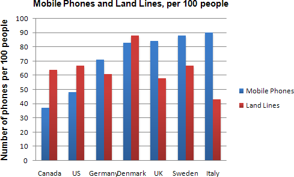

> *model answer:*
>
> The graph shows the number of mobile phones and landlines per 100 users, for selected countries. Overall, most of the countries included in the graph have more mobile phones subscribers than landlines.
>
> Most European countries have high mobile phone use. The biggest users of mobile phones are the Italians, with 88 cell phones per 100 people. For example, Italy has twice as many mobile phones as landlines, with 88 mobiles per hundred people compared to 45 for landlines. Mobile phone use is low in Canada, with fewer than 40 phones per 100 people. Denmark is also unusual because it has slightly more landlines than mobile phones.
>
> However, in some countries, the number of landlines is higher than the number of mobile phones. One example is the USA, where the number of mobiles, at 50 per 100 people, is much lower than the number of landlines, at almost 70 per hundred. A similar pattern can be seen in Canada. The highest number of landlines in the graph is in Denmark, with about 90 per 100 people. In contrast, the lowest figures for fixed lines are in Italy and the UK.
>
> In conclusion, it seems that mobile phone use is higher in Europe than in North America.

# IELTS Graph \#20

You should spend about 20 minutes on this task.

> The graphs show enrolment in different colleges in the Higher Colleges of Technology in 1999. Write a total of 150 - 200 words about the information in the three graphs.
>
> Write a report for a university lecturer describing the information given.
>
> You should write at least 150 words.
>
> 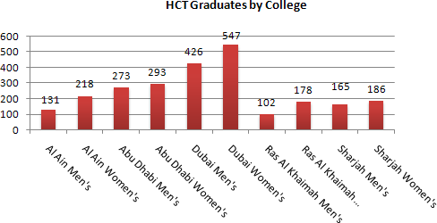 

> *model answer:*
>
> The charts shows student enrolment by gender and level in different colleges of the Higher Colleges of Technology colleges in the UAE.
>
> There are clear differences in male and female enrolment. Females outnumber men in all the colleges, with almost 25% more students in Dubai Women's college than in Dubai Men's. Ras Al-Khaimah Women's College has almost 180 students, compared to only 100 in the Men's college.
>
> Females also outnumber males by level, with almost double the number of men at Higher Diploma level (330 compared to 181). Only at Diploma level does the number of men slightly exceed that of women.
>
> Over half the students are in Certificate level, with less than a quarter at Higher Diploma or Bachelor level.
>
> In conclusion, most students in the Higher Colleges are enrolled at Diploma level or below, and the majority of students are women.
>
> (143 words)

# IELTS Graph \#21

You should spend about 20 minutes on this task.

> **The line graph below shows the number of annual visits to Australia by overseas residents. The table below gives information on the country of origin where the visitors came from. Write a report for a university lecturer describing the information given.**
>
> You should write at least 150 words.

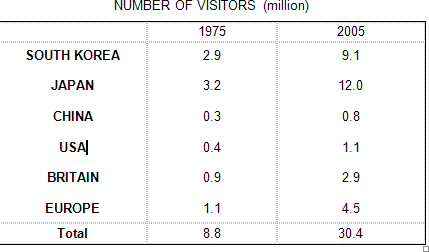

> *model answer:*
>
> The given line graph illustrates information on the number of overseas visitors traveling to Australia in millions of people. Overall, one notable trend seems to be that Australia has steadily become more popular as a destination spot. For example, there were 20 million more visitors to Australia in 2005 than in 1975. That's a jump from 10 million to 30 million in 20 years.
>
> The second table gives statistics showing the countries whose residents went to Australia between 1975 and 2005. In both years, the largest number of visitors came from Japan, followed by South Korea and Europe. Britain, the United States and China also had many people traveling to Australia in these years. In fact, the number of people visiting Australia grew in every one of these countries. For example, in 2005, 12 million people went there from Japan compared with only 3.2 million in 1975.
>
> (147 words)

# IELTS Graph \#22

You should spend about 20 minutes on this task.

> **The table below shows the consumer durables (telephone, refrigerator, etc.) owned in Britain from 1972 to 1983.**
>
> **Write a report for a university lecturer describing the information shown below.**
>
> You should write at least 150 words.

> *model answer:*
>
> The chart shows that the percentage of British households with a range of consumer durables steadily increased between 1972 and 1983. The greatest increase was in telephone ownership, rising from 42% in 1972 to 77% in 1983. Next came centralheating ownership, rising from 37% of households in 1972 to 64% in 1983. The percentage of households with a refrigerator rose 2 1% over the same period and of those with a washing machine by 14%.
>
> Households with vacuum-cleaners. televisions and dishwashers increased by 8%, 5% and 2% respectively. In 1983. the year of their introduction, 18% of households had a video recorder.
>
> The significant social changes reflected in the statistics are that over the period the proportion of British houses with central heating rose from one to two thuds, and of those with a phone from under a half to over three-quarters.
>
> Together with the big increases in the ownership of washing machines and refrigerators, they are evidence of both rising living standards and the trend to lifestyles based on comfort and convenience.

# IELTS Graph \#23

You should spend about 20 minutes on this task.

> **The table below shows the figures for imprisonment in five countries between 1930 and 1980. Write a report for a university, lecturer describing the information shown below.**
>
> You should write at least 150 words.

> *model answer:*
>
> The table shows that the figures for imprisonment in the five countries mentioned indicate no overall pattern of increase or decrease. In fact there is considerable fluctuation from country to country.
>
> In Great Britain the numbers in prison have increased steadily from 30 000 in 1930 to 80,000 in 1980. On the other hand in Australia, and particularly in New Zealand the numbers fell markedly from 1930 to 1940. Since then they have increased gradually, apart from in 1980 when the numbers in prison in New Zealand fell by about 30,000 from the 1970 total. Canada is the only country in which the numbers in prison have decreased over the period 1930 to 1980, although there have been fluctuations in this trend. The figures for the United States indicate the greatest number of prisoners compared to the other four countries but population size needs to be taken into account in this analysis. The prison population in the United States increased rapidly from 1970 to 1980 and this must be a worrying trend.

# IELTS Graph \#24

You should spend about 20 minutes on this task.

> **The graph above show information of employment rates across 6 countries in 1995 and 2005.**
>
> **Summarize the information by choosing and describe the main idea, and make comparisons where appropriate.**
>
> You should write at least 150 words.

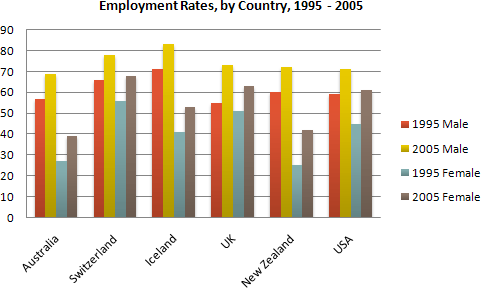

> *model answer:*
>
> The graph shows changes in employment rates in six countries between 1995 and 2005, for men and women. Overall more and more people of working age are employed, and there have been significant improvements for women, although they leg behind men in entering the workforce.
>
> The most obvious trend in the graph is that women have lower employment rates in most of the countries in the graph. For example, in Australia in 1995, 57 percent of men could find work or retain a job, but only 27 percent of women. The difference was even bigger in New Zealand, with 60 percent of women. Even in Switzerland and Iceland, alightly more men than women were in the job market.
>
> The second biggest trend in the graph is the improvement in employment between 1995 and 2005. In all countries shown, figures for both men and women improved. The biggest change was in the United Kingdom, from 55 percent of men in 1995 to 73 percent over the ten years period.
>
> Furthermore, the increases in employment rates for women were much higher in New Zealand. The percentage of working women jumped from 25 percent to 42 percent, and in the United States from 45 percent to 61 percent over the decade.
>
> In conclusion, all the countries in the graph showed at least a 12 percent increase in employment rates of both men and women over the ten yeares. While men had relatively higher employment rate throughout the period, more and more women appear to be entering the labour market.

# IELTS Graph \#25

You should spend about 20 minutes on this task.

> **The line graph below gives information on cinema attendance in the UK. Write a report for a university lecturer describing the information given.**
>
> You should write at least 150 words.

> *model answer:*
>
> The given line graph illustrates information on the percentage of people who went to the movies in the United Kingdom between 1990 and 2010. The people's attendance is divided into four different age groups.
>
> Overall, younger people seemed to, and are predicted to, be more active in movie going than their older counterparts. However, all four age groups showed a gradual increase in attendance numbers during the given period, except for a slight drop between 1995 and 2000.
>
> To be specific, a larger percentage of people between the ages of 24 and 34 went to, and are expected to, go to the cinema than those in any other age group. Approximately 51% of the respondents from this age group are expected to attend movies in 2010 compared with only 38% in 1990. Even in the group that had the smallest number of movie goers, those between the ages of 44 and 54, there was an increase of 6% in their attendance.
>
> (161 words)

# IELTS Graph \#26

You should spend about 20 minutes on this task.

> **The graph shows Underground Station Passenger Numbers in London.**
>
> **Summarise the information by selecting and reporting the main features, and make comparisons where relevant.**

- **You should write at least 150 words.**

- **You should spend about 20 minutes on this task.**

> *model answer:*
>
> The graph shows the fluctuation in the number of people at a London underground station over the course of a day.
>
> The busiest time of the day is in the morning. There is a sharp increase between 06:00 and 08:00, with 400 people using the station at 8 o'clock. After this the numbers drop quickly to less than 200 at 10 o'clock. Between 11 am and 3 pm the number rises, with a plateau of just under 300 people using the station.
>
> In the afternoon, numbers decline, with less than 100 using the station at 4 pm. There is then a rapid rise to a peak of 380 at 6pm. After 7 pm, numbers fall significantly, with only a slight increase again at 8pm, tailing off after 9 pm.
>
> Overall, the graph shows that the station is most crowded in the early morning and early evening periods.

# IELTS Graph \#27

> **The graph shows Internet Usage in Taiwan by Age Group, 1998-2000.**
>
> **Summarise the information by selecting and reporting the main features, and make comparisons where relevant.**

- **You should write at least 150 words.**

- **You should spend about 20 minutes on this task.**

> *model answer:*
>
> The graph shows changes in the age profile of Internet users in Taiwan between 1998 and 2000. The main users of the Internet in Taiwan are young adults between 16 and 30 years old. In 1998,
>
> they accounted for more than half of all users. In 1999 the number dropped slightly to 45%, but even in 2000 they were the biggest group.
>
> The second biggest group of users is aged between 31 and 50. They made up 41% in 1998, falling slightly to 37% in 2000. When combined with the 16-30 age group, over 94% of users in 1998 were between 16 and 50.
>
> However this number is dropping steadily as more children and older users log on. In 1999, the number of children online quadrupled from 2% to 8%, and it continued to increase in 2000. There were similar increases for older users, rising from 4% in 1998 to 10% in 2000.
>
> In summary, while adults between 16 and 50 still represent the great majority of Internet users in Taiwan, their share is declining as more children and older users join the web.

# IELTS Graph \#28

> **Write a report for a university lecturer describing the information below.**

- **You should write at least 150 words.**

- **You should spend about 20 minutes on this task.**

> *model answer:*
>
> The chart shows male and female graduates from the Higher Colleges of Technology colleges in the UAE.
>
> The most outstanding feature of the graph is female graduates outnumber males in all the colleges. For example, in Dubai, there are 30% more women graduates than men. There are also large differences in Al Ain and in Ras Al Khaimah. However, the number of men and women is almost equal in the colleges in Abu Dhabi.
>
> There are also big differences in the sizes of the colleges. Ras Al Khaimah has less than 300 students altogether, while Abu Dhabi has about 600 and Dubai has almost 1000
>
> In summary, women outnumber men in all the colleges, and there are significant differences in the sizes of the colleges.

# IELTS Graph \#29

> **The graph shows estimated oil production capacity for several Gulf countries between 1990 and 2010.**
>
> **Summarise the information by selecting and reporting the main features, and make comparisons where relevant.**

- **You should write at least 150 words.**

- **You should spend about 20 minutes on this task.**

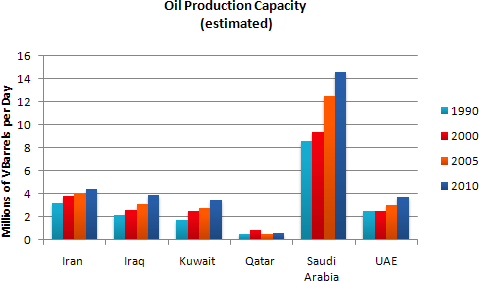

> *model answer:*
>
> The graph shows Oil Production Capacity in millions of barrels per day for selected Gulf countries. There are several features in this graph.
>
> The most significant feature is that oil production will increase sharply in almost all the countries shown. Kuwait and Iraq are both expected to double their output between 1990 and 2010, with Kuwait's production rising from 1.8 million barrels per day (bpd) in 1990 to 3.8 in 2010. Iran will also increase its output by a slightly smaller amount. After remaining steady at 2.5 million bpd from 1990 to 2000, the UAE's output is expected to approach 4.0 million bpd in 2010. Only Qatar's production is predicted to fall, back to 0.8 million bpd after a slight rise in 2000.
>
> However, the greatest increase will be from Saudi Arabia. In 1990, its output capacity at 8.5 million bpd exceeded the combined production of Iran, Iraq and Kuwait. This lead is expected to continue with a 75% increase in production to 14.5 million bpd 2010.
>
> In summary, while most of the countries are expected to show increases, Saudi Arabia will maintain and strengthen its position as the major producer.

# IELTS Graph \#30

> **The chart below shows information about Heart Attacks by Age and Gender in USA. Summarise the information by selecting and reporting the main features, and make comparisons where relevant.**

- **You should write at least 150 words.**

- **You should spend about 20 minutes on this task.**

> *model answer:*
>
> The graph shows how age and gender influence the frequency of heart attacks in the US.
>
> Less than 6% of all heart attacks occur in the 29-44 age group. The number of women who suffer heart attacks in this group is negligible - only 3000 per year, compared to 123,000 men.
>
> However the proportion of men and women with heart attacks rises dramatically between 45 and 64, with over half a million per year. Over 420,000 men a year in this age group have heart attacks. The incidence amongst women increases - women have one heart attack for every three men in this age group.
>
> Over the age of 65, the number of men suffering heart attacks only increases slightly. However there is a huge increase in the number of women with heart attacks - they comprise over 40% of all victims.
>
> In conclusion, men are more likely to be the victims of heart attacks at all ages, but women are increasingly likely over the age of 65.

# IELTS Graph \#31

> **The chart below shows the amount spent on six consumer goods in four European countries.**
>
> **Write a report for a university lecturer describing the information shown below.**

- **You should write at least 150 words.**

- **You should spend about 20 minutes on this task.**

> *model answer:*
>
> The chart shows that Britain, among the four European countries listed, has spent most heavily on the range of consumer goods included. In every case, British spending is considerably higher than that of other countries; only in the case of tennis racquets does another country, Italy, come close.
>
> In contrast, Germany is generally the lowest spender. This Is most evident in photographic film, where Germany spends much less than Britain. Germany only spends more than another country, France, in two cases; tennis racquets and perfumes.
>
> Meanwhile, France and Italy generally maintain middle positions, averaging approximately similar spending overall. Specifically, France spends more on CDs and photographic film but less on tennis racquets than Italy does. Italys spending on personal stereos is only marginally greater than that of France, while spending on toys is equal between the two.
>
> It is clear from the data given that there are some significant differences in spending habits within Europe.

# IELTS Graph \#32

> **The chart below shows the amount of money per week spent on fast foods in Britain. The graph shows the trends in consumption of fast foods.**
>
> **Write a report for a university lecturer describing the information shown below.**

- **You should write at least 150 words.**

- **You should spend about 20 minutes on this task.**

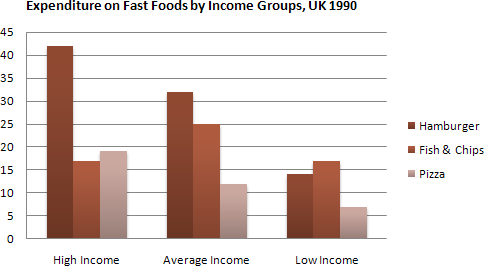

> *model answer:*
>
> The chart shows that high income earners consumed considerably more fast foods than the other income groups, spending more than twice as much on hamburgers (43 pence per person per week) than on fish and chips or pizza (both under 20 pence). Average income earners also favoured hamburgers, spending 33 pence per person per week, followed by fish and chips at 24 pence, then pizza at 11 pence. Low income earners appear to spend less than other income groups on fast foods, though fish and chips remains their most popular fast food, followed by hamburgers and then pizza.
>
> From the graph we can see that in 1970, fish and chips were twice as popular as burgers, pizza being at that time the least popular fast food. The consumption of hamburgers and pizza has risen steadily over the 20 year period to 1990 while the consumption of fish and chips has been in decline over that same period with a slight increase in popularity since 1985.

# IELTS Graph \#33

**Write a report describing the information in the graph below.**

- **You should write at least 150 words.**

- **You should spend about 20 minutes on this task**

> *model answer:*
>
> The line graph shows estimated sales of gold in Dubai for 12 months in 2002 in millions of dirhams. There were two main seasons for gold sales.
>
> The main season for sales is in the December to May period. Sales were consistently above 200 million dirhams per month, rising sharply to a peak of 350 million dirhams in March. However, for the next four months, sales declined steadily, reaching an annual low of 120 million dirhams in July.
>
> In August, there was a sudden increase. Sales almost doubled, rising from 120 million dirhams in July to 210 million dirhams in August. This was followed by a drop in September, back to the July figure.
>
> From September to October, sales recovered, from 120 to 180 million. In October and November, sales remained steady, and there was a small increase in December to 190 million dirhams.
>
> In conclusion, the main sales period is in the early part of the year, slumping in the summer, except for a sudden increase in August.

# IELTS Graph \#34

**Write a report describing the information in the graph below.**

• **You should write at least 150 words.**

• **You should spend about 20 minutes on this task.**

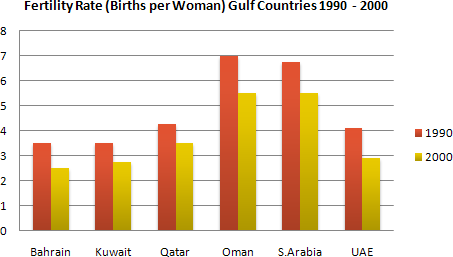

> *model answer:*
>
> The chart shows striking changes in the fertility rate of women in six Gulf countries – Saudi Arabia, the UAE, Oman, Qatar, Kuwait and Bahrain between 1990 and 2000.
>
> In the ten year period, there was a decline in the number of births per woman in all countries. The biggest declines were in two countries which had low fertility rates at the start of the decade, Bahrain and the UAE.
>
> Fertility rates vary greatly between the six countries. Oman and Saudi Arabia had the highest rates, with over seven births per woman in 1990. This compared with around 4 births per woman in Bahrain and the UAE, and just 3.75 in Kuwait
>
> By 2000, the rate had fallen below three births per woman in Kuwait, Bahrain and the UAE, with a drop of over 25% in a decade in the UAE. However, in Saudi Arabia and Oman, the rates fell by just 20%, from 7.0 to 5.5.
>
> In summary, there were major decreases in birth rates in all countries, but some countries in the region have double the fertility rate of others.

# IELTS Graph \#35

**Write a report for a university lecturer describing the information below.**

• **You should write at least 150 words.**

• **You should spend about 20 minutes on this task.**

> 
>
> *model answer:*
>
> The graph shows changes in the amount of fast food consumed in the UK between 1970 and 1990. Several trends are apparent. First, Britons are eating more and more fast food. Secondly, the type of fast food has changed.
>
> In 1970, the most popular fast food was fish and chips. Over 300g were consumed each week. By 1990, however, this had fallen to just over 200g - a 50% drop. Consumption of other fast foods such as pizza and hamburgers increased, however. The amount of pizza eaten shot up from about 20g a week to more than 270g, overtaking fish and chips in the late 1980s. Hamburger consumption also increased, rising from about 80g in 1970 to almost 300g in 1990.
>
> Accompanying this change in the choice of foods was an increase in the amount of fast food consumed. In 1970, British consumers ate about 450g a week of fast food. In 1990, on the other hand, this had more than doubled, to 1000g.
>
> *alternative answer:*
>
> The graph shows the amount of fast food eaten between 1970 and 1990 in grams per person per week. Overall, the amount of fast food eaten more than doubled.
>
> The amount of fish and chips eaten declined slightly. In 1970, the consumption was about 300g/week. This fell to 220g/week in 1990.
>
> In contrast, sales of hamburger and pizza rocketed. In 1970, very little pizza was eaten - less than 50g/week. This rose to 280g/week by 1990. In the same period, hamburger sales shot up by more than 500%, from 100g/week in 1970 to 500 grams in 1990.
>
> In conclusion, although there was a big increase in the consumption of pizza and hamburger, sales of fish and chips decreased.

# IELTS Graph \#36

**Write a report for a university lecturer describing the information below.**

- **You should write at least 150 words.**

- **You should spend about 20 minutes on this task.**

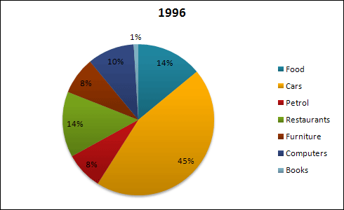

> *model answer:*
>
> The pie charts show changes in American spending patterns between 1966 and 1996.
>
> Food and cars made up the two biggest items of expenditure in both years. Together they comprised over half of household spending. Food accounted for 44% of spending in 1966, but this dropped by two thirds to 14% in 1996. However, the outlay on cars doubled, rising from 23% in 1966 to 45% in 1996.
>
> Other areas changed significantly. Spending on eating out doubled, climbing from 7% to 14%. The proportion of salary spent on computers increased dramatically, up from 1% in 1996 to 10% in 1996. However, as computer expenditure rose, the percentage of outlay on books plunged from 6% to 1%.
>
> Some areas remained relatively unchanged. Americans spent approximately the same amount of salary on petrol and furniture in both years.
>
> In conclusion, increased amounts spent on cars, computers, and eating out were made up for by drops in expenditure on food and books.

# IELTS Graph \#37

**Write a report for a university lecturer describing the information below.**

- **You should write at least 150 words.**

- **You should spend about 20 minutes on this task.**

> 
>
> *model answer:*
>
> The graph shows weekly expenditure on fast food in Britain by food and income group. There are two main trends. First, the expenditure is directly related to income. Secondly, there are differences in the types of fast food eaten by each group.
>
> The amount of money spent on fast food is related to income. People in the high-income group spent the most - over 85 pence per person per week. People in the low-income group spent the least - less than half of what the high-income earners spent.
>
> The type of fast food eaten also depends on the group. High-income earners spent 3 times more on hamburgers than people in the low-income group. Pizza was generally the least favorite food. Fish and chips was the most popular food with the low-income group but consumption was fairly similar among all groups.

# IELTS Graph \#38

> **Write a report for a university lecturer describing the information below.**

- **You should write at least 150 words.**

- **You should spend about 20 minutes on this task.**

> *model answer:*
>
> The graphs show health and education spending and changes in life expectancy and infant mortality in the UAE. Overall, as the percentage spent on health and education increases, infant mortality and life expectancy improve.
>
> Graph 1 shows the percentage of GDP spent on health and education between 1985 and 1993. There were big increases in both areas. Health spending stood at about 8% in 1985 but rose to 9% in 1990 and 10% in 1993. Spending on education was even higher. It was 10% in 1985, and shot up to 14% in 1990 and 15% in 1993, a 50% increase in just 8 years.
>
> Graph 2 shows improvements in life expectancy and infant mortality between 1970 and 1992. Life expectancy was just 60 in 1970 but rose to almost 72 in 1992. In contrast, the number of babies dying dropped dramatically, from 60 per 1000 in 1970 to only 22 in 1992.
>
> In conclusion, people in the UAE are living longer and healthier lives because of the government's spending on education and medical facilities.

# IELTS Graph \#39

> **The graph below shows the different modes of transport used to travel to and from work in one European city in 1960, 1980 and 2000.**
>
> **Write a report for a university lecturer describing the information below.**

- **You should write at least 150 words.**

- **You should spend about 20 minutes on this task.**

> *model answer:*
>
> The graph shows the changing patterns in commuting by train, car, tube or bus for commuters in London in the years 1960, 1980 and 2000.
>
> The number of people using trains at first rose from just under 20% in 1960 to about 26% in 1980, but then fell back to about 23% in 2000.
>
> Use of the tube has been relatively stable, falling from around 27% of commuters in 1960 to 22% in 1980, but climbing back to reach 25% by 2000.
>
> On the other hand, the use of cars increased steadily from just over 5% in 1960 to 23% in 1980, reaching almost 40% by 2000, whereas the popularity of buses has declined since 1960, falling from just under 35% in 1960 to 27% in 1980 and only 15% in 2000.
>
> The graph indicates the growing use of cars for commuting to work between 1960 - 2000, and the corresponding decline in the popularity of buses from being the most popular mode of transport in 1960 to the least popular in 2000.

# IELTS Graph \#40

> **Write a report describing the information in the graph below.**

- **You should write at least 150 words.**

- **You should spend about 20 minutes on this task.**

> *model answer:*
>
> The chart shows striking differences in the level of computer and Internet penetration in the Arab world.
>
> The UAE and Kuwait are by far the most computerized countries, with Lebanon a distant third. The UAE has over 150 computers for every 1000 inhabitants, compared to Kuwait's 130 and Lebanon's
>
> 60\. In contrast, countries such as Egypt, Morocco and Syria have less than 20 computers per 1000 inhabitants.
>
> There are also great differences in Internet use and availability. The UAE has by far the highest proportion of users, with more than one-third of its population using the Internet. Kuwait and Lebanon are second and third again, with 100 users per thousand in Kuwait and 80 in Lebanon. In some countries the number using the Internet is negligible: Saudi Arabia has less than 20 users per thousand, and there are fewer than 5 users per thousand in Syria.
>
> One unusual feature of the graph is that Internet use does not seem to be directly related to the number of computers. In several countries (the UAE, Lebanon, Jordan and Oman), there are more Internet users per thousand people than computers. However, in other countries, such as Kuwait, Saudi Arabia and Syria, the number of Internet users is lower than the number of computers.
>
> In summary, there are major differences between computer use and Internet use in the Arab world, but the UAE clearly leads the area in both number of computers and number of internet users per capita.

# IELTS Graph \#41

> **Write a report for a university lecturer describing the information in the table below.**

- **You should write at least 150 words.**

- **Allow yourself 20 minutes for this task.**

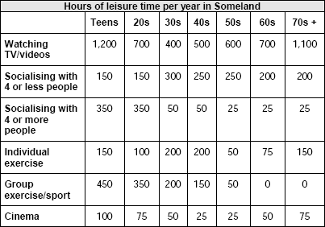

> *model answer:*
>
> The table shows how people in different age groups spend their leisure time in Someland over the course of a year. It can be clearly seen that the amount of leisure time available varies considerably across the age groups and that people of different age levels have very different ways of spending their leisure time.
>
> According to the figures, as people age in Someland their social lives reduce. Teenagers and people in their twenties spend on average 500 hours per year on socialising and 350 hours of that time is with a group of more than 4 people. Although the total hours of socialising in their 30s, 40s, 50s and 60s is fairly constant (between 300-350), socialising with more than 4 people drops dramatically to 50 hours in the 30s and 40s age groups and only 25 from 50 years old. Group and individual exercise follow a similar pattern.
>
> People of all ages spend a good part of their leisure time on entertainment such as TV/video viewing and cinema. In both cases, teenagers and retired people spend around twice as much time as those who are at working age. Home entertainment ranges from just over a thousand hours for teenagers and retired people and an average of 600 hours for everyone else. Cinema accounts for 100 hours of the teenagers and retired people’s leisure time and 25-50 hours for the rest.
>
> In conclusion we can see there is a significant trend towards solitary and smaller group activities as people grow older and that teenagers and retired people spend a lot more time on entertainment than those of working age do.

# IELTS Graph \#42

> **Write a report for a university lecturer describing the information in the two graphs below.**

- **You should write at least 150 words.**

- **Allow yourself 20 minutes for this task.**

- 

> *model answer:*
>
> The pie charts compare the highest level of education achieved by women in Someland across two years, 1945 and 1995. It can be clearly seen that women received a much higher level of education in Someland in 1995 than they did in 1945.
>
> In 1945 only 30% of women completed their secondary education and 1% went on to a first degree. No women had completed post-graduate studies. This situation had changed radically by 1995. In 1995, 90% of women in Someland had completed secondary education and of those, half had graduated from an initial degree and 20% had gone on to postgraduate studies. At the other end of the scale we can see that by 1995 all girls were completing lower secondary, although 10% ended their schooling at this point. This is in stark contrast with 1945 when only 30% of girls completed primary school, 35% had no schooling at all and 35% only completed the third grade.
>
> In conclusion, we can see that in the 50 years from 1945 to 1995 there have been huge positive developments to the education levels of women in Someland.

# IELTS Graph \#43

> **Write a report for a university lecturer describing the information in the graphs below.**

- **You should write at least 150 words.**

- **Allow yourself 20 minutes for this task.**

> *model answer:*
>
> The graphs compare the number of deaths caused by six diseases in Someland in 1990 with the amount of research funding allocated to each of those diseases. It can be clearly seen that the amount of research funding in many cases did not correlate with the seriousness of the disease in terms of numbers of deaths.
>
> In 1990 there were around 0.2 million deaths from AIDS, 0.1 million deaths from leprosy, 0.3 million deaths from tropical diseases, 0.5 million deaths from diarrhoea, 0.4 million deaths from malaria and 1.8 million deaths from TB. These figures can be contrasted with the amount of funding allocated for each disease. In 1990 AIDS received 180 million dollars in research funding, leprosy 80 million dollars in research funding, tropical diseases 79 million dollars in research funding, diarrhoea 60 million dollars in research funding, malaria 50 million dollars and TB 20 million dollars in research funding.
>
> In conclusion it is clear that funding allocation for disease research in Someland is not wholly determined by the number of deaths for which each disease is responsible in a given year.

# IELTS Graph \#44

> **Write a report for a university lecturer describing the information in the graph below.**

- **You should write at least 150 words.**

- **Allow yourself 20 minutes for this task.**

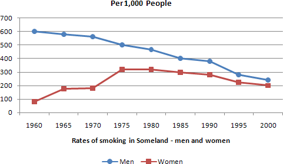

> *model answer:*
>
> The graph compares the rate of smoking in men and women in Someland between the years 1960 and 2000. It can be clearly seen that the rate of smoking for both men and women is currently declining and that fewer women have smoked throughout the period.
>
> In 1960, 600 men in every 1,000 was smoking. This number decreased gradually to 500 by 1974 and continued to decrease but more steeply to 250 in 2000. In contrast, the rate of smoking in women in 1960 was very low at only 80 in every 1,000. By 1968 this increased to 170, and increased again but more steeply to 320 in 1977. The rate of female smokers then remained stable at 320 until 1984 at which point the figures began to decline and had dropped to 200 by 2000.
>
> In conclusion we can see that the rate of smoking in men dropped throughout the whole period but was always at a higher level than the female figures. The rate of smoking in women increased until 1977 but then decreased for the rest of the period.

# IELTS Graph \#45

> **The chart below shows the amount of leisure time enjoyed by men and women of different employment status.**
>
> **Write a report for a university lecturer describing the information shown below.**

- **You should write at least 150 words.**

- **Allow yourself 20 minutes for this task.**

> *model answer:*
>
> The chart shows the number of hours of leisure enjoyed by men and women in a typical week in 1998-9, according to gender and employment status.
>
> Among those employed full-time, men on average had fifty hours of leisure, whereas women had approximately thirty-seven hours. There were no figures given for male part-time workers, but female part-timers had forty hours of leisure time, only slightly more than women in full-time employment, perhaps reflecting their work in the home.
>
> In the unemployed and retired categories, leisure time showed an increase for both sexes, as might have been expected. Here too, men enjoyed more leisure time over eighty hours, compared with seventy hours for women, perhaps once again reflecting the fact that women spend more time working in the home than men.
>
> Lastly, housewives enjoyed approximately fifty-four hours of leisure, on average. There were no figures given for househusbands! Overall, the chart demonstrates that in the categories for which statistics on male leisure time were available, men enjoyed at least ten hours of extra leisure time.

# IELTS Graph \#46

> **The chart below shows the sleep patterns of people in five different occupations according to a Canadian study.**
>
> **Write a report for a university lecturer, describing the information below. Give possible reasons for the differences.**

- **You should write at least 150 words.**

- **Allow yourself 20 minutes for this task.**

> *model answer:*
>
> Differences in sleep patterns appear to reflect differences in individuals' occupations.
>
> A Canadian study has pointed out, for example, that students typically sleep for a consecutive 8- hour period each night, from 11 p.m. to 7 a.m. This may be because the central activity in their lives, study, takes place in normal daylight hours. Similarly, business executives sleep consecutive hours, but perhaps because their jobs are especially busy and stressful they sleep for 6 hours on average, getting up around 5 a.m..
>
> By contrast, truck drivers, probably because of their need to keep their trucks on the road over long periods, tend to sleep in two 3-hour blocks: one between 7 and 10 a.m. and another from 4 to 7 p.m. Another occupation associated with broken sleep schedules is that of doctors. They tend to retire to bed around 1 a.m. and start their day at 7 a.m.., but may be woken up to deal with emergencies in the middle of the night. Finally, full-time mothers, especially those with young children, tend to sleep when their babies do. Typically, they will sleep from 10 p.m. and be awoken at 1 a.m. to comfort their babies for a couple of hours. They then go back to bed to wake at 6 a.m., but nap for two hours or so in the early afternoon.
>
> Thus the influence on one's sleep pattern is worthy of consideration when choosing an occupation.

# IELTS Graph \#47

> **The diagram below shows the average hours of unpaid work per week done by people in different categories. (Unpaid work refers to such activities as childcare in the home, housework and gardening.)**
>
> **Describe the information presented below, comparing results for men and women in the categories shown. Suggest reasons for what you see.**

- **You should write at least 150 words.**

- **You should spend about 20 minutes on this task.**

> *model answer:*
>
> The diagram reveals that the number of hours per week spent in unpaid work is unequally distributed between men and women.
>
> In households where there are no children, women are reported to work some 30 hours per week in such tasks as housework and gardening. Men's contribution to these unpaid jobs averages a considerably lower 18 hours.
>
> When children enter the household, however, the inequality becomes even more pronounced. In families of 1 - 2 children, men maintain approximately the same number of hours of unpaid work as in childless households, but the number of hours women work in the home rises to 52 per week, much of it, on doubt, due to childcare responsibilities.
>
> Interestingly, when there are three or more children in the household, men are found to work even fewer hours around the house than before the appearance of the third child. Whereas women's unpaid hours rise to approximately 56 per week, the corresponding figure for men, 16, actually represents a decrease.
>
> The data suggest that the increased presence of women in the paid work force has yet to lead to an increased role for men in the home.

# IELTS Graph \#48

> **The table below shows social and economic indicators for four countries in 1994, according to United Nations statistics.**
>
> **Describe the information shown below in your own words. What implications do the indicators have for the countries?**

- **You should write at least 150 words.**

- **Allow yourself 20 minutes for this task.**

> *model answer:*
>
> A glance at four indicators of economic and social conditions in four countries, Canada, Japan, Peru and Zaire, in 1994 reflects the great differences that exist between wealthier and poorer nations.
>
> The table shows that Japan and Canada had annual incomes of \$15 760 and \$11 100 per person, respectively. These figures were overwhelmingly greater than the corresponding figures of \$160 in Peru and \$130 in Zaire.
>
> Health indicators, too, reflected overall levels of affluence in the four nations. Life expectancy at birth, for example, was higher among the more economically developed countries. Japan reported the highest life expectancy, 78. This was followed by Canada, 76; Peru, 51; and Zaire, 47; This suggests that richer societies are able to put more money into health care than poorer ones.
>
> The amount of calories consumed daily per person roughly followed the same ranking. Canadians each consumed some 3 326 calories per day while the Japanese took 2846 calories. The corresponding figures for Peru and Zaire were 1927 and 1749, respectively.
>
> Literacy rates among adults, too, were higher in wealthier countries, no doubt a reflection of ability to invest in education. Canada and Japan both reported literacy rates of 99%, while Peru claimed 68%. Zaire, the least economically developed of the four countries, had a literacy rate of 34%.
>
> The data appear to confirm the often cited link between national wealth and health and education standards.

# IELTS Graph \#49

> **The diagram below shows the typical stages of consumer goods manufacturing, including the process by which information is fed back to earlier stages to enable adjustment.**
>
> **Write a report for a university lecturer describing the process shown.**

- **You should write at least 150 words.**

- **You should spend about 20 minutes on this task.**

> *model answer:*
>
> Most consumer goods go through a series of stages before they emerge as finished products ready for sale.
>
> Raw materials and manufactured components comprise the initial physical input in the manufacturing process. Once obtained, these are stored for later assembly. But assembly first depends upon the production planning stage, where it is decided how and in what quantities the stored materials will be processed to create sufficient quantities of finished goods. The production planning stage itself follows the requirements of the goods' design stage that proceeds from extensive research. After assembly, the products are inspected and tested to maintain quality control l Those units that pass the inspection and testing stages are then packaged, despatched and offered for sale in retail outlets. The level of sales, which is the end point of the manufacturing process, helps determine production planning.
>
> A product's design is not only the result of product research, but is also influenced by testing and market research. If the testing stage (after assembly and inspection) reveals unacceptable problems in the finished product, then adjustments will have to be made to the product's design. Similarly, market research, which examines the extent and nature of the demand for products, has the role of guiding product design to suit consumer demands which may change with time.
>
> Market research, while influenced by product sales, also serves to foster future sales by devising suitable advertising for the goods.
>
> Thus the reality of consumer goods manufacturing goes well beyond a simple linear production process.

# IELTS Graph \#50

You should spend about 20 minutes on this task.

> **Eating sweet foods produces acid in the mouth, which can cause tooth decay. (High acid levels are measured by low pH values)**
>
> **Describe the information below and discuss the implications for dental health.**
>
> You should write at least 150 words.

> *model answer:*
>
> Anyone who has visited a dentist has been told that eating excessive amounts of sweets risks harming the teeth. This is because sweets lower pH levels in the mouth to dangerous levels.
>
> When the pH level in the mouth is kept above 5.5, acidity is such that teeth are unlikely to be in danger of decay. Sweet foods, however, cause pH in the mouth to drop for a time, and the longer pH levels remain below 5.5, the greater the opportunity for decay to occur.
>
> By comparing fruit sugar, cane sugar and honey, which are all common ingredients of sweet foods, we find that cane sugar lowers pH levels for the longest period, thus producing the greatest risk of the three. Approximately five minutes aftfter consuming cane sugar, pH levels drop to as little as pH 3.5. They then begin to rise slowly, but do not rise above pH 5.5 until at least 30 minutes have elapsed. By contrast, fruit sugar, which causes the mouth's acidity to fall to just above pH 4, poses a danger for a shorter period: tooth decay is unlikely 20 minutes after consumption. Honey appears an even less risky substance. Though acidity falls to about pH 4.75 within five minutes of consumption, it returns to above pH 5.5 in under fifteen minutes.
>
> The implications, then, are that people who insist on eating sweet foods should be aware of the ingredients, and that fruit sugar or honey appear preferable to cane sugar.
>
> (242 words)

# IELTS Graph \#51

You should spend about 20 minutes on this task.

> **The graphs below show the numbers of male and female workers in 1975 and 1995 in several employment sectors of the republic of Freedonia.**
>
> **Write a report for a university teacher describing the information shown.**
>
> You should write at least 150 words.

> *model answer:*
>
> The two decades between 1975 and 1995 brought significant changes in the representation of women in Freedonia's work force, according to the graphs.
>
> In 1975, for example, some 300 000 men and 250 000 women worked in the communications sector. Twenty years later, though the number of men remained unchanged, the number of women rose to 550 000.
>
> A similar situation was seen in the wholesale and retail trade sector, where the number of women rose from about 550 000 in 1975 to almost 800 000 two decades later. The number of men in this sector remained stable over the period, at around 700 000.
>
> Women also made gains in both the finance/banking industries and in the defence-related public sector. Whereas some 125 000 women worked in finance and banking institutions in 1975, the number increased to 450 000 by 1995. The number of men grew only marginally from 425 000 to 480 000 over the same period. In defence, the number of men declined from 225 000 to 200 000, while the number of women rose from 25 000 to over 100 000.
>
> Two sectors that retained stable employment numbers for both men and women were manufacturing, which had about 300 000 women and 650 000 men in both surveyed years, and the public sector (non-defence), which employed 650 000 women and 850 000 men.
>
> Thus, women appear to have made gains in the Freedonian work force but not at the expense of men. (243 words)

# IELTS Graph \#52

> **The graphs below show the types of music albums purchased by people in Britain according to s3x and age.**
>
> **Write a report for a university lecturer describing the information shown below.**

- **You should write at least 150 words.**

- **You should spend about 20 minutes on this task.**

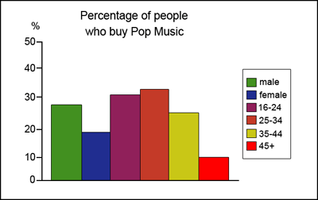 

> *model answer:*
>
> The three graphs provide an overview of the types of music people purchase in the UK. At first glance we see that classical music is far less popular than pop or rock music.
>
> While slightly more women than men buy pop music, the rock market is dominated by men with 30% buying rock, compared to 17% of women. From the first graph we see that interest in pop music is steady from age 16 to 44 with 20% of the population continuing to buy pop CDs after the age of 45.
>
> The interest in rock music reaches its peak among the 25 to 34 year olds, though it never sells as well as pop. Interest also drops off after the age of 35 with an even sharper fall from age 45 onwards, a pattern which is the opposite to the classical music graph.

# IELTS Graph \#53

> **The chart below gives information about global sales of games software, CDs and DVD or video.**
>
> **Write a report for a university lecturer describing the information.**

- **You should write at least 150 words.**

- **You should spend about 20 minutes on this task.**

> *model answer:*
>
> The chart shows the changes in the sales of video material / DVDs, games software and CDs around the world in billions of dollars over a three-year period. It can be seen that the sales of videos / DVDs and games software have increased, while the sales of CDs have gone down slightly.
>
> Between 2000 and 2003, the sale of videos and DVDs rose by approximately 13 billion dollars. In 2000, just under 20 billion dollars worth of these items were sold, but in 2003, this figure had risen to a little over 30 billion dollars.
>
> The sales of games software also rose during this period, but less sharply. Sales increased from about 13 billion dollars in 2000 to just under 20 billion dollars three years later. By contrast, during the same time period, the sale of CDs fell from 35 billion dollars in 2000 to about 32.5 billion dollars in 2003.

# IELTS Graph \#54

> **The chart and graph below give information about sales and share prices for Coca-Cola. Write a report for a university lecturer describing the information shown below.**

- **You should write at least 150 words.**

- **You should spend about 20 minutes on this task.**

> *model answer:*
>
> The pie chart shows the worldwide distribution of sales of Coca-Cola in the year 2000 and the graph shows the change in share prices between 1996 and 2001.
>
> In the year 2000, Coca-Cola sold a total of 17.1 billion cases of their fizzy drink product worldwide. The largest consumer was North America, where 30.4 per cent of the total volume was purchased. The second largest consumer was Latin America. Europe and Asia purchased 20.5 and 16.4 per cent of the total volume respectively, while Africa and the Middle East remained fairly small consumers at 7 per cent of the total volume of sales.
>
> Since 1996, share prices for Coca-Cola have fluctuated. In that year, shares were valued at approximately \$35. Between 1996 and 1997, however, prices rose significantly to \$70 per share. They dipped a little in mid-1997 and then peaked at \$80 per share in mid-98. From then until 2000 their value fell consistently but there was a slight rise in mid-2000.
